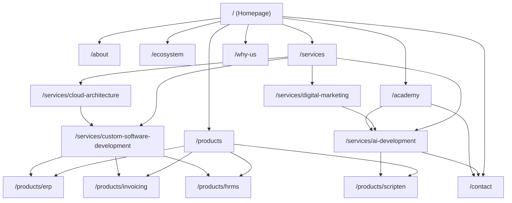

# Vertex Loop — Internal Linking Graph & Page Authority Architecture

**Target Goal:** Maximize PageRank distribution, thematic relevance, and crawler discoverability without orphan pages.

---

## 1. Top-Level Internal Linking Hierarchy

---

## 2. Navigation Link Architecture

### Header Navigation (`Navbar.tsx`)
* **Logo (`/`):** Vertex Loop Home
* **Who We Are (`/about`)**
* **Ecosystem (`/ecosystem`)**
* **Services (`/services`):** Dropdown linking to AI Development, Custom Software, Cloud Architecture, Digital Marketing.
* **Products (`/products`):** Dropdown linking to ERP System, Invoicing Software, HRMS System, SCRIPTen.
* **Academy (`/academy`)**
* **Why Us (`/why-us`)**
* **Contact CTA (`/contact`)**

### Footer Link Grid (`Footer.tsx`)
* **Column 1 — Proprietary Products:** ERP System (`/products/erp`), Digital Invoicing (`/products/invoicing`), HRMS Software (`/products/hrms`), SCRIPTen (`/products/scripten`).
* **Column 2 — Service Verticals:** AI Development (`/services/ai-development`), Custom Software (`/services/custom-software-development`), Cloud Architecture (`/services/cloud-architecture`), Digital Marketing (`/services/digital-marketing`).
* **Column 3 — Company & Education:** About Vertex Loop (`/about`), Tech Academy (`/academy`), Why Choose Us (`/why-us`), Contact (`/contact`).
* **Column 4 — Legal & Compliance:** Privacy Policy (`/privacy-policy`), Terms & Conditions (`/terms-conditions`).

---

## 3. Anchor Text Rules & Guidelines

1. **Exact & Partial Match Balance:** Use descriptive anchor text such as "explore custom AI solutions", "discover our cloud ERP platform", "read about SCRIPTen for video creators".
2. **No Generic Anchors:** Avoid anchors like "click here", "read more", "link".
3. **Cross-Entity Links:**
   - Link from AI Services (`/services/ai-development`) to SCRIPTen (`/products/scripten`) as an example of AI product development.
   - Link from Custom Software (`/services/custom-software-development`) to ERP (`/products/erp`) as an enterprise implementation case.
   - Link from Tech Academy (`/academy`) to AI Services (`/services/ai-development`) for corporate training integration.
