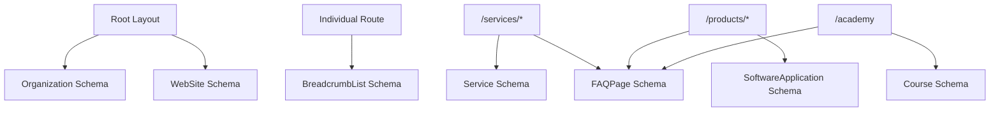

# Vertex Loop — Schema.org Structured Data Strategy

**Target Goal:** Provide 100% syntactically valid JSON-LD schemas across every public route to power Google Rich Results, Knowledge Graphs, and AI Search Entity Attribution.

---

## 1. Schema Hierarchy Matrix



---

## 2. JSON-LD Code Snippet Specifications

### 2.1 Organization Schema (`/` Root)
```json
{
  "@context": "https://schema.org",
  "@type": "Organization",
  "@id": "https://vertexloop.in/#organization",
  "name": "Vertex Loop",
  "url": "https://vertexloop.in",
  "logo": "https://vertexloop.in/logo.png",
  "description": "Vertex Loop is a next-generation technology ecosystem operating across custom AI development, software engineering, cloud architecture, proprietary business software, and technology education.",
  "sameAs": [
    "https://x.com/LoopVertex99532",
    "https://www.linkedin.com/company/vertex-loop",
    "https://github.com/auratech"
  ],
  "contactPoint": {
    "@type": "ContactPoint",
    "contactType": "customer service",
    "email": "hello@vertexloop.io",
    "availableLanguage": ["English"]
  }
}
```

### 2.2 SoftwareApplication Schema (Products: SCRIPTen, ERP, HRMS, Invoicing)
```json
{
  "@context": "https://schema.org",
  "@type": "SoftwareApplication",
  "name": "SCRIPTen",
  "operatingSystem": "Web",
  "applicationCategory": "MultimediaApplication",
  "publisher": {
    "@type": "Organization",
    "name": "Vertex Loop"
  },
  "description": "Proprietary AI-powered content creation and workflow optimization software for video creators, vloggers, and media teams."
}
```

### 2.3 Service Schema (Service Verticals)
```json
{
  "@context": "https://schema.org",
  "@type": "Service",
  "name": "AI Development & Engineering",
  "provider": {
    "@type": "Organization",
    "name": "Vertex Loop"
  },
  "serviceType": "Artificial Intelligence Engineering",
  "areaServed": "Worldwide",
  "description": "Custom AI solutions including LLM integration, autonomous agents, RAG architecture, and fine-tuned machine learning models."
}
```

### 2.4 FAQPage Schema (AEO Answer Callouts)
```json
{
  "@context": "https://schema.org",
  "@type": "FAQPage",
  "mainEntity": [
    {
      "@type": "Question",
      "name": "What is SCRIPTen?",
      "acceptedAnswer": {
        "@type": "Answer",
        "text": "SCRIPTen is a proprietary content creator productivity software developed by Vertex Loop."
      }
    }
  ]
}
```

---

## 3. Implementation Blueprint in Next.js

We implement a dedicated, re-usable React component `src/components/seo/JsonLd.tsx`:

```tsx
import Script from 'next/script'

export default function JsonLd({ data }: { data: Record<string, any> }) {
  return (
    <Script
      id={`json-ld-${Math.random().toString(36).substring(2, 9)}`}
      type="application/ld+json"
      dangerouslySetInnerHTML={{ __html: JSON.stringify(data) }}
    />
  )
}
```
