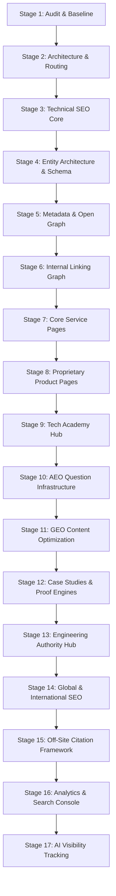

# Vertex Loop — Master SEO & Search Presence Implementation Plan

**Target Domain:** `https://www.vertexloop.in/`  
**Execution Lead:** Principal Technical SEO Architect & Web Systems Engineer  

---

## Roadmap Overview (17-Stage Engineering Master Plan)

---

## Detailed Stage Execution Breakdowns

### Stage 1: Technical & Audit Baseline (Completed)
* Crawl total repository routes, inspect Next.js configurations, metadata, missing schemas, and asset references.
* Deliverable: `SEO_AUDIT.md`.

### Stage 2: Information Architecture & Routing Setup
* Establish clean URL structure in `src/app/`:
  - `/services/ai-development`
  - `/services/custom-software-development`
  - `/services/cloud-architecture`
  - `/services/digital-marketing`
  - `/products/erp`
  - `/products/invoicing`
  - `/products/hrms`
  - `/products/scripten`
  - `/academy`

### Stage 3: Technical SEO Foundations
* Create `src/app/sitemap.ts` dynamically listing all static and product/service routes with `lastmod`, `changefreq`, and `priority`.
* Create `src/app/robots.ts` explicitly permitting search engine crawlers and AI bots (Googlebot, Bingbot, PerplexityBot, GPTBot, ClaudeBot, Applebot).

### Stage 4: Entity Architecture & JSON-LD Schema Engine
* Build `src/components/seo/JsonLd.tsx` supporting:
  - `Organization` (Vertex Loop HQ, social profiles, brand details)
  - `WebSite` (SearchAction, canonical URL)
  - `BreadcrumbList` (Hierarchy per route)
  - `Service` (Per service page)
  - `SoftwareApplication` / `Product` (For ERP, Invoicing, HRMS, SCRIPTen)
  - `FAQPage` (For AEO question blocks)

### Stage 5: Granular Metadata & Open Graph Framework
* Implement per-page helper function `generateMetadata()` leveraging `siteConfig` to output custom `<title>`, `<meta description>`, `alternates.canonical`, `openGraph`, and `twitter` tags.

### Stage 6: Internal Linking Graph Optimization
* Refactor `Navbar.tsx` and `Footer.tsx` to include rich navigation links targeting product entities and service verticals.
* Add contextually relevant cross-links in page body content.

### Stage 7 & 8: Service & Product Page Implementation
* Build full, high-converting, answer-first client/server pages for all primary service verticals and proprietary products (ERP, Invoicing, HRMS, SCRIPTen).

### Stage 9: Tech Academy Hub
* Build dedicated `/academy` landing page with bootcamps, corporate upskilling programs, curriculum details, and Course schemas.

### Stage 10 & 11: AEO & GEO Infrastructure
* Embed concise, direct 2-3 sentence definition callouts at the top of every key page to serve as snippet fodder for ChatGPT, Perplexity, Gemini, and Google AI Overviews.

### Stage 12 & 13: Proof Engines & Engineering Knowledge Hub
* Add case study frameworks and technical engineering guides demonstrating real architectural expertise.

### Stage 14: Global & International Strategy
* Establish multi-region target positioning (India, USA, UAE, Singapore, UK) using structured location signals and localized business entity framing.

### Stage 15: Off-Site Citation & Map Presence Setup
* Create step-by-step setup guides for Google Business Profile, Bing Places, Apple Business Connect, Crunchbase, Product Hunt, and LinkedIn.

### Stage 16 & 17: Search Console, Analytics & AI Monitoring
* Integrate GSC / Bing Webmaster tracking guidelines and design an AI visibility monitoring dashboard for LLM citations.

---

## Verification Plan

### Automated Checks
* Execute `npm run build` to verify zero TypeScript errors, SSR/hydration issues, or broken route imports.
* Validate generated `sitemap.xml` and `robots.txt` output.
* Run JSON-LD schema syntax validation on all schemas.

### Manual Verification
* Inspect page metadata in browser elements.
* Verify mobile layout responsiveness and design visual fidelity across desktop and mobile screens.
